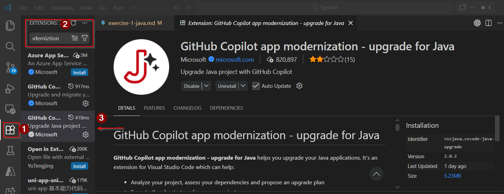

# Exercise 1: Java Tournament Service Modernization 

**Duration**: 30 minutes  
**Difficulty**: ⭐⭐⭐ Intermediate  
**Prerequisites**: Java 17+, Maven 3.8+, GitHub Copilot enabled

## The Challenge

The **Tournament Service** is the backbone of Game Arena Legends. It handles tournament creation, player registration, bracket generation, and match scheduling. Built in 2018 with Spring Boot 2.7, it's showing its age:

- Blocking I/O operations causing slow response times during peak traffic
- Outdated dependencies with known security vulnerabilities
- Missing observability for production debugging
- No support for reactive programming patterns

Your mission: **Modernize this service to handle 10x the current traffic using Spring Boot 3.2 and reactive patterns.**


## Getting Started

**Clone the repository:**

```bash
git clone https://github.com/CanarysPlayground/app-modernization-workshop.git
cd app-modernization-workshop
cd legacy-code/java-tournament-service
```

**Verify your environment:**

```bash
java -version
mvn -version
```

Ensure you have:
- **Java 17+** installed → [Download JDK 17+](https://adoptium.net/temurin/releases/)
- **Maven 3.8+** installed → [Download Maven](https://maven.apache.org/download.cgi)
- **GitHub Copilot extensions** active in VS Code:
  - [GitHub Copilot Chat](https://marketplace.visualstudio.com/items?itemName=GitHub.copilot-chat)
  - [GitHub Copilot App Modernization - Java Upgrade](https://marketplace.visualstudio.com/items?itemName=vscjava.vscode-java-upgrade)

**Build the legacy code:**

```bash
mvn clean install
mvn spring-boot:run
```

Test the API in another terminal:
```bash
curl http://localhost:8080/api/tournaments
```

## Modernization Workflow

### Step 1: Use Copilot for Assessment (4 minutes)


1. **Install GitHub Copilot App Modernization - Java Upgrade**

   Open extension and search for  "GitHub Copilot App Modernization - Java Upgrade". Install if you haven't already.

   

2. **Select the Right Model for Assessment:**

   Click the Copilot icon → **Model Selector** → Choose:
   - **GPT-4** for comprehensive analysis (recommended for assessment)
   - **Claude 4.5 Sonnet** for alternative perspective

3. **Use Copilot Chat local agent- ask agent for Assessment:**

   Open Copilot Chat (`Ctrl+Alt+I` or `Cmd+Alt+I`) and ask:
   ```
   Analyze this Spring Boot project. What version is it using? What needs to be upgraded for Spring Boot 3.2? Identify deprecated dependencies and breaking changes.
   ```

   The analysis will cover:
   - Current framework versions
   - Deprecated dependencies
   - Breaking changes (javax→jakarta)
   - Reactive patterns recommendations
   - Migration steps

4. **Select Custom agent AppModernization**


### Step 2: Upgrade and Verify (10 minutes)

**Upgrade the application:**

Open `pom.xml` and use Copilot to upgrade:
```
"Migrate to Spring Boot 3.2.0 with Java 17, converting from blocking (Web/JPA) to fully reactive (WebFlux/R2DBC)"

```

**Expected Results:**

Copilot automatically transforms:
-  Spring Boot 2.3 → 3.2, Java 11 → 17
- `javax.*` → `jakarta.*`
- Controllers/Services/Repositories → Reactive (`Flux`/`Mono`)
- `JpaRepository` → `ReactiveCrudRepository`


## Key Takeaways

Single comprehensive prompt triggers complete stack modernization  
@workspace analyzes entire project structure before changes  
Spring Boot 3.2 requires Java 17+ and jakarta namespace  
Reactive patterns: Flux (0..N), Mono (0..1) for non-blocking I/O

## Additional Resources

- [Spring Boot 3.0 Migration Guide](https://github.com/spring-projects/spring-boot/wiki/Spring-Boot-3.0-Migration-Guide)
- [Spring WebFlux Documentation](https://docs.spring.io/spring-framework/reference/web/webflux.html)
- [Project Loom (Virtual Threads)](https://openjdk.org/projects/loom/)
- [GitHub Copilot for Java](https://docs.github.com/en/copilot/tutorials/modernize-java-applications)

## Next Steps

Congratulations! You've modernized the Tournament Service. 


**[Exercise 2: CVE Detection & Security Hardening →](exercise-2-java-cli.md)**
- Learn Copilot CLI automation with custom agents
- Detect and fix CVEs using MCP server tools
- Generate security tests with AI
- **Duration**: 25 minutes


---

**Achievement Unlocked: Java Modernization Expert!**
