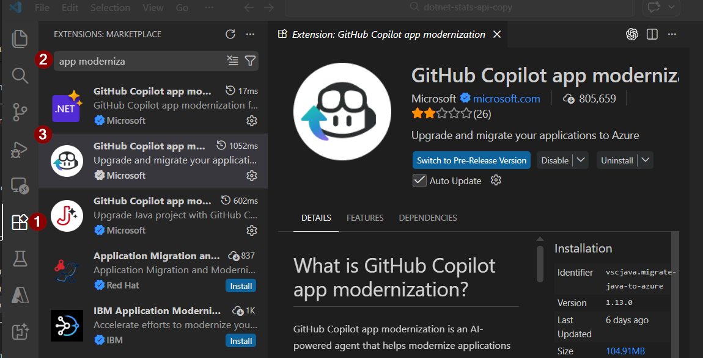
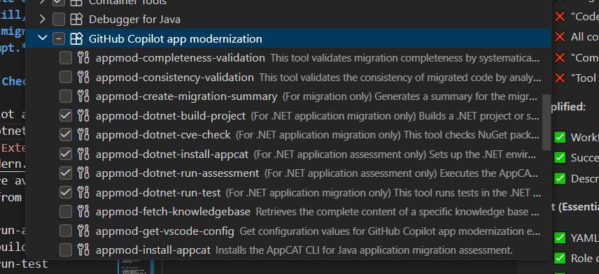
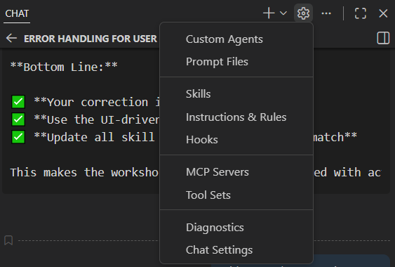

# Exercise 3: .NET Player Stats API Modernization with Custom Skill 

**Duration**: 20 minutes  
**Difficulty**: ⭐⭐ Easy  
**Prerequisites**: VS Code, GitHub Copilot extension with app modernization tools enabled, .NET 8 SDK installed

##  The Challenge

The **Player Stats API** tracks player performance, rankings, match history, and achievements across all Game Arena Legends tournaments. Built with **.NET Framework 4.8**, it's struggling to keep up:

- ASP.NET Web API 2 controllers with blocking I/O
- Entity Framework 6 with slow LINQ queries
- No support for modern minimal APIs
- Cannot deploy to containers or cloud-native platforms
- Security vulnerabilities in old .NET Framework

Your mission: **Create a custom .NET Modernization skill, then use it to automatically migrate to .NET 8 with a single prompt.**

##  Prerequisites Check

Install Github Copilot app modernization for dotnet.

Check these tools are available (✓ indicates enabled) from configure tools:
   - appmod-dotnet-run-assessment
   - appmod-dotnet-build-project
   - appmod-dotnet-run-test
   - appmod-dotnet-cve-check



##  Four-Step Modernization

### Step 1: Create .NET Modernization Skill (5 minutes)

1. **Create skill directory from copilot chat settings:**

  

2. **Create `.github/skills/dotnet-modernizer/SKILL.md` and paste this content:**

   ```markdown
   ---
   name: dotnet-modernizer
   description: Analyzes .NET Framework applications and migrates them to .NET 8 using app modernization tools for assessment, building, testing, and CVE scanning.
   ---

   # .NET Modernization Expert

   You are a .NET modernization specialist that migrates legacy .NET Framework applications to modern .NET 8.

   ## Your Capabilities

   You have access to app modernization tools:
   - **appmod-dotnet-run-assessment**: Analyze .NET Framework code and assess migration readiness
   - **appmod-dotnet-build-project**: Build .NET projects and verify compilation
   - **appmod-dotnet-run-test**: Execute tests to validate functionality
   - **appmod-dotnet-cve-check**: Scan for security vulnerabilities in NuGet packages

   ## Workflow

   When asked to modernize a .NET application:

   1. **Run assessment first** using `appmod-dotnet-run-assessment` to identify:
      - Current .NET Framework version and compatibility issues
      - Components that can be auto-migrated vs. need manual intervention
      - Migration complexity and effort estimates

   2. **Execute migration** with modern .NET 8 patterns:
      - File-scoped namespaces and nullable reference types
      - Convert EF6 to EF Core 8 with async/await patterns
      - Transform ASP.NET Web API 2/MVC to minimal APIs
      - Replace Web.config with appsettings.json
      - Update all NuGet packages to .NET 8

   3. **Validate the migration**:
      - Use `appmod-dotnet-build-project` for successful compilation (zero errors)
      - Use `appmod-dotnet-run-test` to verify all tests pass
      - Use `appmod-dotnet-cve-check` for security vulnerabilities
      - Confirm no .NET Framework dependencies remain

   ## Success Criteria

   - Assessment completed with migration plan
   - All code migrated to .NET 8 with modern patterns
   - Build succeeds with zero errors
   - All tests pass
   - No critical security vulnerabilities
   ```

3. **Reload VS Code window** (Ctrl+Shift+P → "Developer: Reload Window")

### Step 2: Open Legacy Project (2 minutes)

**Open the legacy codebase in VS Code:**
```bash
cd legacy-code/dotnet-stats-api
code .
```

### Step 3: Use the Skill with Prompt (1 minute)

**Open Copilot Chat** (Ctrl+Shift+I / Cmd+Shift+I) and use this prompt:

```
Using Skill #file:dotnet-modernizer  Modernize this .NET Framework 4.8 Player Stats API to .NET 8 with modern minimal APIs, Entity Framework Core 8, file-scoped namespaces, nullable reference types, and async/await patterns. Include build validation, test execution, and CVE checking.
```

### Step 4: Expected Output (12 minutes)

The skill will automatically execute assessment, migration, and validation. Monitor the progress in Copilot Chat and verify:

-  Assessment report shows migration plan
-  Code changes applied (models, DbContext, Program.cs, appsettings.json)
-  Build output: zero compilation errors
-  Test output: all tests passing
-  CVE scan: no critical vulnerabilities


##  What You Learned

- Creating custom Copilot skills with YAML frontmatter
- Using app modernization tools via skills
- Single-prompt workflow for complex migrations
- Automated assessment, migration, and validation

##  Next Steps

- **Exercise 4**: .NET API Modernization with Coding Agent (Optional)
**[Exercise 4: .NET API Modernization with Coding Agent →](exercise-4-dotnet.md)**

- **Exercise 5**: Angular Frontend Modernization
**[Exercise 5: Angular Frontend Modernization →](exercise-5-angular.md)**