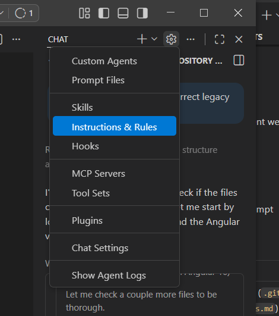

# Exercise 5: Angular Tournament Dashboard Modernization 

**Duration**: 20 minutes  
**Difficulty**: ⭐⭐ Intermediate  
**Prerequisites**: Node.js 20+, npm 10+, GitHub Copilot enabled

## The Challenge

The **Tournament Dashboard** is the primary interface for tournament organizers and players. Built with **Angular 12** in 2021, it's missing modern features:

- NgModules everywhere (not standalone)
- RxJS BehaviorSubject instead of signals
- Old template syntax (*ngIf, *ngFor)
- Missing modern Angular 18 features

Your mission: **Create custom Copilot instructions, then use one prompt to upgrade to Angular 18 with standalone components, signals, and modern architecture.**

## Prerequisites Check

Verify you have:
- Node.js 20+ and npm 10+ installed
- Angular CLI: `npm install -g @angular/cli@18`
- GitHub Copilot extension enabled in VS Code

Check Angular version in legacy project:
```bash
cd legacy-code/angular-dashboard
cat package.json | grep "@angular/core"
# Should show: "^12.2.0"
```

## Two-Step Modernization

### Step 1: Create Custom Instructions (5 minutes)

1. **Create the instruction file from copilot chat settings:**




2. **Create `.github/instructions/angular-modernization.instructions.md` and paste this content:**

   ```markdown
   ---
   description: Angular 12 to Angular 18 modernization instructions for standalone components, signals, and modern template syntax
   applyTo: '**/*.{ts,html,css,json}'
   ---

   # Angular Modernization Instructions

   Provide guidance for modernizing this Angular 12 application to Angular 18 with standalone components, signals, and modern patterns.

   ## Modernization Workflow

   When asked to modernize this Angular application, follow this sequence:

   ### 1. Update Dependencies (Incremental Approach)
   **CRITICAL:** Angular requires incremental major version updates: 12→13→14→15→16→17→18. Direct upgrade will fail.

   **Option A:** Run `ng update` incrementally for each major version (recommended for production)
   **Option B:** Directly update package.json to Angular 18 + TypeScript ~5.4.0 + RxJS ~7.8.0 + zone.js ~0.14.0 (for learning/demo, use `npm install --force`)

   ### 2. Convert to Standalone Architecture
   - Delete `app.module.ts` completely
   - Update `main.ts` to use `bootstrapApplication()` with `provideRouter()` and `provideHttpClient()`
   - Create `app.routes.ts` with Routes array
   - Convert all components: add `standalone: true`, add `imports` array (CommonModule, RouterLink, RouterOutlet), remove @NgModule declarations

   ### 3. Implement Signals (Angular 16+)
   **State Management:**
   - Replace `BehaviorSubject` with `signal()`, use `computed()` for derived state from signals only
   - HTTP calls still return Observables - use `toSignal()` to convert, keep Observables for streams/timers/events
   - Use `takeUntilDestroyed()` instead of manual unsubscribe

   **Signal APIs (Angular 17+):**
   - Inputs: `input()`, `input.required()` replace @Input decorators
   - Outputs: `output<T>()` replaces @Output decorators
   - Two-way binding: `model<T>()` replaces [(ngModel)]
   - Queries: `viewChild()`, `viewChildren()`, `contentChild()`, `contentChildren()` replace @ViewChild/@ContentChild decorators
   - Side effects: `effect()` for signal reactions
   - Lifecycle: `inject(DestroyRef).onDestroy()` replaces ngOnDestroy

   ### 4. Modernize Template Syntax (Angular 17+)
   - Replace `*ngIf` with `@if`/`@else`
   - Replace `*ngFor` with `@for` (use `track` expressions, add `@empty` block)
   - Replace `[ngSwitch]` with `@switch`/`@case`/`@default`
   - Use `@defer` with `@placeholder`/`@loading`/`@error` for lazy loading
   - Remove `async` pipe where signals are used

   ### 5. Apply Modern Best Practices
   - Use `inject()` function instead of constructor dependency injection
   - Add `ChangeDetectionStrategy.OnPush` to all components
   - Remove unused imports and lifecycle hooks
   - Ensure all paths and imports are correct after restructuring

   ## Success Criteria
   - All `@angular/*` packages are version 18
   - No `app.module.ts` or `@NgModule` declarations exist
   - All components have `standalone: true`
   - `main.ts` uses `bootstrapApplication()`
   - All services use `signal()` instead of `BehaviorSubject`
   - All templates use `@if` and `@for` instead of `*ngIf` and `*ngFor`
   - Components use `inject()` instead of constructor injection
   - Application builds successfully: `npm run build`
   - Application runs correctly: `npm start`
   ```


### Step 2: Use Prompt to Modernize (1 minute)

**Open Copilot Chat** (Ctrl+Shift+I / Cmd+Shift+I) and use this prompt:

```
@workspace Modernize this Angular 12 Tournament Dashboard to Angular 18. convert NgModules to standalone components, replace BehaviorSubject with signals, update template syntax to @if/@for, and use modern Angular 18 patterns throughout.
```

### Step 3: Install Dependencies (2 minutes)

**Navigate to the project and install dependencies:**

```bash
cd legacy-code/angular-dashboard
npm install
```

### Step 4: Expected Output (10 minutes)

Monitor Copilot's changes and verify:

1. **Check `main.ts`** - Uses `bootstrapApplication()` instead of `platformBrowserDynamic()`
2. **Verify components** - All have `standalone: true`
3. **Check services** - Use `signal()` instead of `BehaviorSubject`
4. **Review templates** - Use `@if` and `@for` instead of `*ngIf` and `*ngFor`


##  What You Learned

- Creating custom Copilot instructions for project-specific guidance
- Single-prompt workflow for complex Angular modernization
- Converting NgModules to standalone architecture  
- Replacing RxJS BehaviorSubject with signals
- Modern Angular 18 template syntax (@if, @for)

##  Next Steps

- **Exercise 6**: DevOps Pipeline Modernization
**[Exercise 6: DevOps Pipeline Modernization →](exercise-6-devops-data.md)**

---

** Achievement Unlocked: Angular Modernization Expert!**
